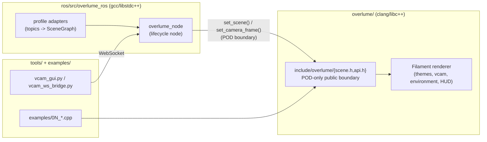

# Overlume

Overlume is a real-time rendering layer that turns any robot's live sensor
and autonomy data into a polished, human-friendly picture of what it sees
and does. It ships as a ROS-free C++ library (`overlume/`, built on Google's
[Filament](https://github.com/google/filament) renderer) behind a POD-only
public API, plus a ROS 2 lifecycle node (`ros/src/overlume_ros/`) that feeds
it a robot's live topics — cameras, lidar, tracked objects, HD-map elements,
occupancy grids, and a virtual-camera control surface a GUI or a WebSocket
client can drive.


## Features

- **Themes** — data-driven YAML palettes (`dark_adas`, `light_clay`) covering
  sun/IBL/fog/grid/road tokens, with an animated crossfade between them.
- **Virtual camera** — scripted presets, eased tweens, and free-look orbit,
  driven over ROS services/topics or a WebSocket bridge + GTK GUI.
- **Environment sources** — an offline OSM-footprint bake
  (`overlume/scripts/bake_environment.py`) or live Cesium ion 3D Tiles
  streaming (Cesium OSM Buildings, Google Photorealistic 3D Tiles, or a
  deployment's own clipped asset), switchable live with no restart.
- **Layers** — every rendered category (objects, paths, map elements, grids,
  alerts, generic markers, point clouds, HUD, callouts, environment) has its
  own live disable knob, whole-category, no code change needed to add a new
  topic under an existing category.
- **HUD** — a node-side composited speed/mode readout and leader-line alert
  callouts anchored to 3D objects.
- **Quality governor** — a node-side auto-drop-with-hysteresis on measured
  `render_ms`, plus a library `set_quality()`/`get_quality()` preset switch.

## Quick start

**Toolchain** (root-less clang-18/libc++-18 bootstrap, idempotent):

```bash
overlume/scripts/setup_toolchain_cesium.sh
```

**Build the library:**

```bash
cmake --toolchain "$PWD/overlume/cmake/toolchain-clang-libcxx.cmake" \
    -B overlume/build -S overlume -DOVERLUME_ENABLE_CESIUM=ON
cmake --build overlume/build -j
```

See `overlume/README.md` and the setup scripts for the full rationale
(why clang/libc++, why Filament is pinned, why cesium is optional).

**Run the headless example** (renders one frame, writes a PNG, no display
needed):

```bash
overlume/build/examples/01_hello_frame
```

See `examples/README.md` for the rest of the example programs (scene
population, themes, virtual camera, environment, overlays/point cloud).

**Build the ROS 2 node:**

```bash
cd ros && ./colcon_build.sh
```

**Run it against the recorded fixture bag:**

```bash
tools/validate_visual_mode.sh
```

**Run the pre-merge gate** (POD-header check, library ctest, node gtests, WS
bridge tests, golden suite — see `docs/runbooks/ci_gate.md`):

```bash
tools/ci_visual_mode.sh
```

## Architecture

A clang/libc++ library behind a POD-only header pair, consumed by a gcc ROS 2
node through that boundary — the two toolchains never mix at a `std::`
boundary (ADR-0003).



## Documentation

[`docs/README.md`](docs/README.md) is the docs index — runbooks, the design
spec, ADRs, plans, and the path map for older documents. API docs are
generated by the `docs` target (Doxygen) — see `docs/README.md` once that
target lands.

## Status

[`docs/status.md`](docs/status.md) is the single status ledger: shipped
epics, open items, and known gaps.

## License

Apache-2.0 — see [LICENSE](LICENSE).
