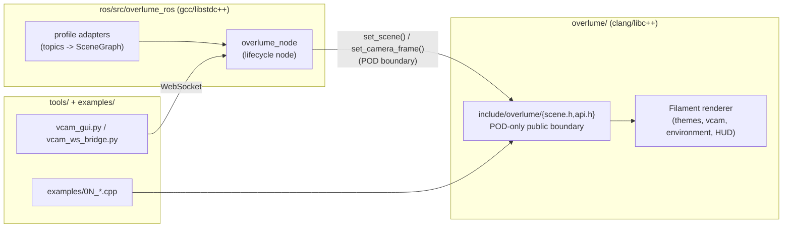

# Overlume

[](LICENSE)
[](https://github.com/amerghazal7/overlume/actions/workflows/lint.yml)
[](https://github.com/amerghazal7/overlume/actions/workflows/build.yml)

Overlume is a real-time rendering layer that turns any robot's live sensor
and autonomy data into a polished, human-friendly picture of what it sees
and does. It ships as a ROS-free C++ library (`overlume/`, built on Google's
[Filament](https://github.com/google/filament) renderer) behind a POD-only
public API, plus a ROS 2 lifecycle node (`ros/src/overlume_ros/`) that feeds
it a robot's live topics — cameras, lidar, tracked objects, HD-map elements,
occupancy grids, and a virtual-camera control surface a GUI or a WebSocket
client can drive.


## Features

- **Themes** — data-driven YAML palettes (`dark_adas`, `light_clay`) covering
  sun/IBL/fog/grid/road tokens, with an animated crossfade between them.
- **Virtual camera** — scripted presets, eased tweens, and free-look orbit,
  driven over ROS services/topics or a WebSocket bridge + GTK GUI.
- **Environment sources** — an offline OSM-footprint bake
  (`overlume/scripts/bake_environment.py`) or live Cesium ion 3D Tiles
  streaming (Cesium OSM Buildings, Google Photorealistic 3D Tiles, or a
  deployment's own clipped asset), switchable live with no restart.
- **Layers** — every rendered category has its own disable knob: the eight
  `layer_*` categories (objects, paths, map elements, grids, alerts, generic
  markers, point clouds, trajectory carpet) switch live per tick; HUD,
  callouts and the environment are set at launch. Adding a topic under an
  existing category is a profile-YAML row, not code.
- **HUD** — a node-side composited speed/mode readout and leader-line alert
  callouts anchored to 3D objects.
- **Quality governor** — a node-side auto-drop-with-hysteresis on measured
  `render_ms`, plus a library `set_quality()`/`get_quality()` preset switch.

## Install

Prebuilt packages of the library (shared, with Filament, cesium-native and the
C++ runtime baked in and only the `overlume::*` API exported; plus an optional
static product) are published for Linux x86_64/aarch64, macOS universal2,
iOS, Windows x64/arm64 and Android (four ABIs). Every channel below installs
the same release; `<ver>` is the version of the release you want (the latest is
on the [Releases](https://github.com/amerghazal7/overlume/releases) page).
Building from source is under [Quick start](#quick-start).

Release signing key: GPG `89281DE0 3F68406F 29C62CCF 8A1D000F 68FE6404`
(`packaging/keys/overlume-release.asc`, also served at
<https://amerghazal7.github.io/overlume/overlume-release.asc>).

**Linux, apt (Debian 11+, Ubuntu 20.04+; x86_64 and arm64).** Needs glibc 2.28
or newer; the package pulls in `libegl1`, `libgles2`, `libgl1`:

```bash
sudo mkdir -p /etc/apt/keyrings
sudo curl -fsSL https://amerghazal7.github.io/overlume/overlume-release.asc -o /etc/apt/keyrings/overlume.asc
echo "deb [signed-by=/etc/apt/keyrings/overlume.asc] https://amerghazal7.github.io/overlume/apt stable main" \
    | sudo tee /etc/apt/sources.list.d/overlume.list
sudo apt-get update
sudo apt-get install overlume          # runtime + headers + themes + CMake/pkg-config files
sudo apt-get install overlume-static   # optional, see "Static component" below
```

The repository keeps the newest releases, so `sudo apt-get install overlume=<ver>`
pins an older one.

**Linux, dnf/yum (RHEL, Alma, Rocky 8+, Fedora 36+).**

```bash
sudo curl -fsSL -o /etc/yum.repos.d/overlume.repo https://amerghazal7.github.io/overlume/overlume.repo
sudo dnf install overlume              # and optionally: overlume-static
```

`overlume.repo` has `gpgcheck=1` and `repo_gpgcheck=1`; dnf asks you to accept
the key on first use, compare it with the fingerprint above.

**macOS 13+ (Homebrew).**

```bash
brew install amerghazal7/overlume/overlume
```

This installs the universal2 (arm64 + x86_64) tarball under the Homebrew prefix.
The `.pkg` (installs to `/usr/local`) and the `.tar.gz` are also release assets.
Until Apple signing secrets are provisioned the `.pkg` is unsigned and not
notarised (Gatekeeper warns on a double-click; `sudo installer -pkg <file> -target /`
works regardless).

**iOS 15+ / macOS (Swift Package Manager).** In Xcode use File > Add Package
Dependencies with `https://github.com/amerghazal7/overlume-swift`, or in a
`Package.swift`:

```swift
.package(url: "https://github.com/amerghazal7/overlume-swift", from: "<ver>"),
// target dependency:
.product(name: "Overlume", package: "overlume-swift"),
```

The package is a binary target over the release's `Overlume-<ver>.xcframework.zip`
(device arm64, simulator arm64 + x86_64); its headers are C++ (POD structs), so
use it from Objective-C++ or Swift's C++ interoperability.

**Android (Gradle, Maven Central).** API 26+, arm64-v8a, armeabi-v7a, x86_64, x86:

```kotlin
// app/build.gradle.kts
android { buildFeatures { prefab = true } }
dependencies { implementation("io.github.amerghazal7:overlume:<ver>") }
```

```cmake
# app/src/main/cpp/CMakeLists.txt
find_package(overlume REQUIRED CONFIG)
target_link_libraries(app PRIVATE overlume::overlume)         # shared (libc++_shared or c++_static apps)
# or the static module: overlume::overlume_static
```

**Windows 10+ (x64, arm64).** Download `overlume-<ver>-windows-x64.exe` (or
`overlume-<ver>-windows-arm64.exe`) from the release and run it; it installs the runtime (DLL, headers,
themes, CMake files) and optionally the static libraries, and can add
`<prefix>\bin` to `PATH`. Silent install: `overlume-<ver>-windows-x64.exe /S /D=C:\overlume`.
Or unpack `overlume-<ver>-windows-x64.zip` anywhere and point CMake at it.
Binaries are MSVC `/MD`; until Windows signing secrets are provisioned the
installer is unsigned (SmartScreen warns).

**vcpkg (Linux, macOS, Windows).** The release carries an overlay port that
wraps the prebuilt archives (`overlume`, plus `overlume[static]` on Linux and
macOS or the `x64-windows-static-md` triplet on Windows):

```bash
curl -fsSLO https://github.com/amerghazal7/overlume/releases/download/v<ver>/overlume-<ver>-vcpkg-port.zip
unzip overlume-<ver>-vcpkg-port.zip -d overlume-vcpkg-port
vcpkg install overlume --overlay-ports=overlume-vcpkg-port/ports
```

then `-DCMAKE_TOOLCHAIN_FILE=$VCPKG_ROOT/scripts/buildsystems/vcpkg.cmake` and
`find_package(overlume CONFIG REQUIRED)`.

**Conan 2.**

```bash
curl -fsSLO https://github.com/amerghazal7/overlume/releases/download/v<ver>/overlume-<ver>-conan-recipe.zip
unzip overlume-<ver>-conan-recipe.zip -d overlume-conan
conan create overlume-conan --version <ver> -o "overlume/*:shared=True" --build=missing
```

(`shared=False` for the static product; on Linux that needs `-s compiler=clang
-s compiler.version=18 -s compiler.libcxx=libc++`.) Consume it from a
`conanfile.txt` with `overlume/<ver>` and the `CMakeDeps`/`CMakeToolchain`
generators, then `find_package(overlume CONFIG REQUIRED)`.

**Manual archives, verified.** Every release asset is listed in `SHA256SUMS`,
which is signed (`SHA256SUMS.asc`). On Linux an unpacked archive needs the
run-time libraries the packages depend on (`sudo apt-get install libegl1 libgles2 libgl1`,
or `dnf install mesa-libEGL mesa-libGLES libglvnd-glx`). Verify before unpacking:

```bash
V=<ver>; B=https://github.com/amerghazal7/overlume/releases/download/v$V
curl -fsSLO $B/overlume-$V-linux-x86_64.tar.gz -O $B/SHA256SUMS -O $B/SHA256SUMS.asc
curl -fsSL https://amerghazal7.github.io/overlume/overlume-release.asc | gpg --import
gpg --verify SHA256SUMS.asc SHA256SUMS            # "Good signature", key 89281DE0...68FE6404
sha256sum -c --ignore-missing SHA256SUMS          # shasum -a 256 -c on macOS
tar -xzf overlume-$V-linux-x86_64.tar.gz -C /opt   # relocatable: any prefix works
```

**Use it from CMake** (every channel; for a manual archive add
`-DCMAKE_PREFIX_PATH=/opt/overlume-<ver>-linux-x86_64`):

```cmake
find_package(overlume 0.1 REQUIRED)                       # shared
target_link_libraries(app PRIVATE overlume::overlume)
```

Linux and macOS also ship pkg-config (`pkg-config --cflags --libs overlume`).
Set `RenderConfig::theme_assets_dir = nullptr` to use the installed
themes (found next to the library, also from a relocated archive). With no GPU
or EGL device `create_renderer` returns `nullptr` rather than crashing.

**Static component.** `overlume-static` (apt/dnf), `overlume[static]` (vcpkg),
the `static` CMake component and the Windows installer's "Static libraries"
checkbox give `liboverlume.a` plus its dependency archives:

```cmake
find_package(overlume 0.1 REQUIRED COMPONENTS static)
target_link_libraries(app PRIVATE overlume::overlume_static)
```

On Linux the static archive was built with clang and libc++ 18 and does not
bring a C++ runtime: the consumer must use **clang >= 18 with
`-stdlib=libc++`** (CMake refuses a gcc/libstdc++ consumer at configure time
with a clear message). Ubuntu 22.04 and EL9 ship no libc++ 18 and are
unsupported for static; the shared library works with any compiler. On
Windows the static archive is `/MD` Release: link it from a Release or
RelWithDebInfo consumer, with a VS 2022 >= 17.14 linker for x64 and VS 2026
(VC runtime >= 14.51) for arm64.

Known limits of the current releases: no Metal frame has been rendered on a
hosted macOS runner (a one-off check on a real Mac is required before the
first tag, see [`docs/runbooks/release.md`](docs/runbooks/release.md)), and
Apple notarisation and Windows Authenticode signing run only once their
secrets exist. Third-party licenses of everything shipped inside the
binaries are in [`NOTICE`](NOTICE).

## Quick start

**Prerequisite — Git LFS.** Goldens, fixtures, fonts, models and the images
in `docs/` are Git LFS objects. Install `git-lfs` before cloning
(`git lfs install`), or run `git lfs pull` in an existing clone; without it
those files are 130-byte pointers and the golden gate stage fails. The clone
is ~360 MB because history was not rewritten.

**Toolchain** (root-less clang-18/libc++-18 bootstrap, idempotent):

```bash
overlume/scripts/setup_toolchain_cesium.sh
```

**Build the library:**

```bash
cmake --toolchain "$PWD/overlume/cmake/toolchain-clang-libcxx.cmake" \
    -B overlume/build -S overlume -DOVERLUME_ENABLE_CESIUM=ON
cmake --build overlume/build -j
```

See `overlume/README.md` and the setup scripts for the full rationale
(why clang/libc++, why Filament is pinned, why cesium is optional).

**Run the headless example** (renders one frame, writes a PNG, no display
needed):

```bash
overlume/build/examples/01_hello_frame
```

See `examples/README.md` for the rest of the example programs (scene
population, themes, virtual camera, environment, overlays/point cloud).

**Build the ROS 2 node:**

```bash
cd ros && ./colcon_build.sh
```

**Run it against a recorded bag.** The sensor bags this project was developed
against are internal recordings and are **not** distributed with the repo;
point the validation rig at your own ROS 2 bag, or record one from a live
stack with `tools/record_fixture_bag.sh OUT_DIR`:

```bash
tools/validate_visual_mode.sh --bag /path/to/your/bag
```

Without a bag you can still run the headless examples above and the library
test suite; the pre-merge gate below never plays a bag.

**Run the pre-merge gate** (six stages: POD-header check, library ctest, node
gtests, WS bridge tests, golden suite, the examples run headless — see
`docs/runbooks/ci_gate.md`):

```bash
tools/ci_visual_mode.sh
```

## Architecture

A clang/libc++ library behind a POD-only header pair, consumed by a gcc ROS 2
node through that boundary — the two toolchains never mix at a `std::`
boundary (ADR-0003).


```mermaid
flowchart LR
    subgraph ROS2["ros/src/overlume_ros (gcc/libstdc++)"]
        Node["overlume_node\n(lifecycle node)"]
        Adapters["profile adapters\n(topics -> SceneGraph)"]
        Adapters --> Node
    end
    subgraph LIB["overlume/ (clang/libc++)"]
        API["include/overlume/{scene.h,api.h}\nPOD-only public boundary"]
        Renderer["Filament renderer\n(themes, vcam, environment, HUD)"]
        API --> Renderer
    end
    subgraph Tools["tools/ + examples/"]
        GUI["vcam_gui.py / vcam_ws_bridge.py"]
        Examples["examples/0N_*.cpp"]
    end
    Node -- "set_scene() / set_camera_frame()\n(POD boundary)" --> API
    GUI -- "WebSocket" --> Node
    Examples --> API
```

## Documentation

[`docs/README.md`](docs/README.md) is the docs index —
runbooks, the design spec, ADRs, plans, and the path map for older
documents. API docs are generated by the `docs` target (Doxygen):

```bash
cmake --build overlume/build --target docs
```

`.github/workflows/docs.yml` publishes this reference to
<https://amerghazal7.github.io/overlume/> on every push to `main`.
See the "API documentation" section of [`docs/README.md`](docs/README.md#api-documentation)
for how to build it locally.


## Status

[`docs/status.md`](docs/status.md) is the single
status ledger: shipped epics, open items, and known gaps.

## Contributing

Contributions are welcome. See [`CONTRIBUTING.md`](CONTRIBUTING.md) for the
toolchain, build commands, the pre-merge gate, golden promotion convention,
and PR expectations; participation is governed by the
[Code of Conduct](CODE_OF_CONDUCT.md).

## License

Apache-2.0 — see [LICENSE](LICENSE) and [NOTICE](NOTICE) for third-party
attributions.
