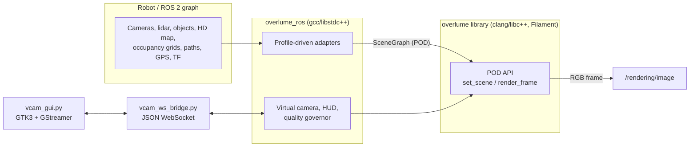

<div align="center">


# Overlume

**Real-time third-person rendering for robots. Overlume turns live sensor and autonomy data into one picture a person can read, through a small POD-only C++ API.**

[](https://github.com/amerghazal7/overlume/actions/workflows/lint.yml)
[](https://github.com/amerghazal7/overlume/actions/workflows/build.yml)
[](LICENSE)

[Hello frame](#hello-frame) ·
[Gallery](#gallery) ·
[Features](#features) ·
[Quick start](#quick-start) ·
[ROS 2 node](#ros-2-node) ·
[Architecture](#architecture) ·
[Docs](#documentation) ·
[Contributing](#contributing)

</div>

---

Overlume has two parts. The first is a ROS-free C++ rendering library built on [Google Filament](https://github.com/google/filament). The second is a ROS 2 lifecycle node that feeds the library live robot data. You give the library a plain-data scene: ego vehicle, tracked objects, paths, map, occupancy grids, alerts and point clouds. It renders the scene offscreen, with no display, and returns an RGB buffer.

- **POD-only public API.** Two headers, `api.h` and `scene.h`, with no `std::` types crossing the boundary. They are append-only, and `overlume/scripts/check_pod_header.sh` enforces this.
- **Headless.** Frames render into an EGL pbuffer, so no window system is needed.
- **Data-driven themes.** Two YAML themes ship, `dark_adas` and `light_clay`, with an animated crossfade between them.
- **Every element can be styled and switched off.** Each rendered element has style tokens and a disable knob.
- **Drop-in for a new robot.** Adding a topic under an existing category takes one row in a profile YAML file, not code.

Version 0.1.0. The scene ABI is `kSceneVersion = 9`. On an RTX 3090 the measured render time is about 10 ms p50 at roughly 30 Hz.

## Hello frame

Condensed from [`examples/01_hello_frame.cpp`](examples/01_hello_frame.cpp). The full example adds error handling and writes a PNG.

```cpp
#include <overlume/api.h>
#include <overlume/scene.h>
#include <vector>

overlume::RenderConfig config{};
config.width = 640;
config.height = 480;
config.quality = 1;                                 // 0 low, 1 med, 2 high
config.theme_assets_dir = "overlume/assets/themes"; // the example takes this as an argument
config.initial_theme = "dark_adas";

overlume::VisualRenderer* renderer = overlume::create_renderer(config);  // nullptr if no GPU/EGL

overlume::CameraPose pose{};
pose.eye[0] = -4.0;   pose.eye[1] = 0.0;    pose.eye[2] = 3.5;
pose.target[0] = 2.0; pose.target[1] = 0.0; pose.target[2] = -0.5;
pose.vfov_deg = 80.0;

std::vector<uint8_t> rgb(static_cast<size_t>(config.width) * config.height * 3);
overlume::FrameView view{rgb.data(), config.width, config.height};
bool ok = overlume::render_frame(renderer, pose, view);  // rgb now holds the frame

overlume::destroy_renderer(renderer);
```

[`examples/`](examples/README.md) holds six runnable examples, and each one writes a PNG headlessly: `01_hello_frame`, `02_scene_population`, `03_themes`, `04_virtual_camera`, `05_environment` and `06_overlays_and_pointcloud`.

## Gallery

These are golden frames from the test suite: the library renders them headlessly and the gate compares every run against them. The one exception is the hybrid frame, which the ROS node composites.

<table>
  <tr>
    <td align="center" width="33%"><br><sub><b>Tracked objects</b><br>classes, labels, predicted paths</sub></td>
    <td align="center" width="33%"><br><sub><b>Path ribbons</b><br>behavior, global and local roles</sub></td>
    <td align="center" width="33%"><br><sub><b>Occupancy grids</b><br>per-layer colour ramps</sub></td>
  </tr>
  <tr>
    <td align="center"><br><sub><b>Alert polygons</b><br>info, warning, critical</sub></td>
    <td align="center"><br><sub><b>Generic markers</b><br>RViz-marker parity</sub></td>
    <td align="center"><br><sub><b>Surround-view bowl</b><br>up to 6 camera feeds</sub></td>
  </tr>
  <tr>
    <td align="center"><br><sub><b>Hybrid mode</b><br>bowl plus colourised lidar (node frame; pre-fix capture, re-shoot pending)</sub></td>
    <td align="center"><br><sub><b>Streamed buildings</b><br>Cesium 3D Tiles</sub></td>
    <td align="center"><br><sub><b>Theme crossfade</b><br>dark_adas to light_clay</sub></td>
  </tr>
</table>

<details>
<summary>More: HD map, ego, baked buildings, both themes, environment sources compared</summary>

<table>
  <tr>
    <td align="center"><br><sub><b>HD-map elements</b></sub></td>
    <td align="center"><br><sub><b>Ego clay-box fallback</b></sub></td>
    <td align="center"><br><sub><b>Baked OSM buildings</b></sub></td>
  </tr>
  <tr>
    <td align="center"><br><sub><b>dark_adas</b></sub></td>
    <td align="center"><br><sub><b>light_clay</b></sub></td>
    <td align="center"><br><sub><b>Centerlines</b></sub></td>
  </tr>
</table>


</details>

## Features

| Element | What you get |
|---|---|
| Ego vehicle | A glTF model via `set_ego_model`, or a clay-box fallback |
| Tracked objects | CAR, TRUCK_VAN, BUS, PEDESTRIAN, CYCLIST and UNKNOWN, each with a predicted path, a label and a staleness fade. CC0 models ship for car, truck/van and pedestrian; the other classes use a clay box |
| Path ribbons | BEHAVIOR, GLOBAL and LOCAL roles, with opacity and metre-based fade |
| HD-map elements | Centerlines, boundaries, crosswalks, stop lines, junctions, road edges and road surface |
| Occupancy grids | Per-layer colour ramps (`ogm.dynamic`, `ogm.geometric`) with yaw |
| Alert polygons | Info, warning and critical severities, coloured by the theme |
| Generic markers | CUBE, SPHERE, CYLINDER, ARROW, LINE_STRIP, LINE_LIST, POINTS, TEXT, TRIANGLE_LIST and MESH (parity with RViz markers) |
| Point clouds | Per-point RGBA. The node can colourise lidar from the cameras |
| Trajectory carpet | `TrajectoryCarpet` scene layer, with its own ROS adapter |
| Surround-view bowl | Stitches up to 6 camera feeds onto a bowl mesh, with feathering and exposure compensation |
| Environment | Baked OSM clay buildings or streamed Cesium 3D Tiles, switchable live |
| Scene dressing | Ground grid, sky, fog, sun shadows and image-based lighting, all set by theme tokens |
| HUD | A speed and mode readout plus leader-line callouts, composited in the node |
| Quality | Presets 0 low, 1 med and 2 high via `set_quality`, plus an optional auto-drop governor in the node |

<details>
<summary><b>Public API summary</b></summary>

**Core** (`api.h`): `create_renderer`, `destroy_renderer`, `render_frame`.

**Scene** (`scene.h`):

| Area | Functions |
|---|---|
| Scene | `set_scene(SceneGraph)` |
| Theme | `set_theme(name, at_sec, transition_sec)`, `theme_assets_loaded`, `theme_parses`, `get_hud_colors` |
| Models | `set_ego_model(gltf, fallback_dims)`, `set_object_model_dir` |
| Projection | `project_to_screen` |
| Surround view | `set_bowl_config`, `set_bowl_visible`, `set_self_view_masks`, `set_camera_motion_delta`, `set_camera_frame` (up to `kMaxBowlCameras = 6`) |
| Environment | `set_environment_source(uri, GeoAnchor)`, `environment_source_state` (NONE, BAKED, STREAMING, STREAMING_FALLBACK), `set_environment_visible`, `environment_visible` |
| Quality | `set_quality`, `get_quality` |

A struct change bumps `kSceneVersion`; adding a free function bumps nothing. The library takes a raw `CameraPose`. Camera presets live in the node.

</details>

### Themes

Themes are YAML token files in `overlume/assets/themes/`. The tokens cover:

- the palette: sky, ground, fog, lane, ribbon, ego, road, building, object tints and alerts
- material, emissive and grid fade
- HUD, sun, IBL and fog
- ribbon widths and fades, and object opacity
- environment tile radius and OGM ramps

`set_theme(..., transition_sec)` switches theme with a crossfade.

### Environment sources

- **Offline bake.** `overlume/scripts/bake_environment.py` turns OSM building footprints into chunked clay buildings. See the [runbook](docs/runbooks/environment_bake.md).
- **Cesium ion 3D Tiles streaming.** The URI form is `ion://<asset>?key=val`. Built-in presets:
  - Cesium OSM Buildings: `ion://96188`
  - Google Photorealistic 3D Tiles: `ion://2275207?materials=original&cache=off`

  Streaming supports terrain following, a geo-anchor from NavSatFix, automatic fallback to the baked source, and live switching with no restart. It needs `CESIUM_ION_TOKEN` set in your environment. See the [runbook](docs/runbooks/cesium.md).

## Quick start

> [!IMPORTANT]
> **Install Git LFS first.** Goldens, fixtures, fonts, models and the images in `docs/` are stored in Git LFS. Run `git lfs install` before you clone, or `git lfs pull` in a clone you already have. Without LFS those files are 130-byte pointers, and the golden stage of the gate fails.

```bash
git clone git@github.com:amerghazal7/overlume.git && cd overlume

# 1. Toolchain: clang-18 / libc++-18, installed without root and cached in ~/.cache (safe to re-run)
overlume/scripts/setup_toolchain_cesium.sh

# 2. Library
cmake --toolchain "$PWD/overlume/cmake/toolchain-clang-libcxx.cmake" \
    -B overlume/build -S overlume -DOVERLUME_ENABLE_CESIUM=ON
cmake --build overlume/build -j

# 3. Render your first frame headlessly to a PNG
overlume/build/examples/01_hello_frame
```

**Requirements**

| | |
|---|---|
| OS | Ubuntu 22.04 (glibc 2.35) |
| GPU | Any GPU with EGL. Hosted CI runs only the CPU-only tests |
| Library | clang-18 / libc++-18 (installed by the script) and CMake 3.18 or newer. Filament is pinned to the sha256-verified 1.56.5 prebuilt SDK, because newer releases need glibc 2.38 or later |
| Node | ROS 2 Humble with CycloneDDS |
| GUI | Python 3.10, GTK3 and GStreamer |

> [!NOTE]
> The library is built with clang/libc++ and the ROS node with gcc/libstdc++. The two never meet at a `std::` boundary, which is why the public API is POD-only. See [ADR-0003](docs/adr/0003-pod-boundary-clang-libcxx-lib.md) and [`overlume/README.md`](overlume/README.md).

## ROS 2 node

`ros/src/overlume_ros/` is a lifecycle node for **ROS 2 Humble**.

```bash
cd ros && ./colcon_build.sh && source install/setup.bash
ros2 launch overlume_ros overlume_node.launch.py autostart:=true   # pass params_file:=<yaml> for your robot
```

The node has three render modes, which you switch live on `/rendering/set_mode` (Int32) or with the `render_mode` parameter:

- **1, bowl:** surround view stitched from the camera feeds.
- **2, hybrid:** the bowl plus colourised lidar.
- **3, free look:** a virtual-camera scene. Buildings appear only in this mode.

<details>
<summary><b>Topics, services, profiles and parameters</b></summary>

**Publishes:** `/rendering/image` (sensor_msgs/Image), `/rendering/camera_info`, `~/vcam_state`, `~/diagnostics` (DiagnosticArray, includes `render_ms`), `~/ego_state`.

**Subscribes** (profile-driven):
- MarkerArray topics for the HD map, dynamic objects, collision, generic markers and the trajectory carpet
- nav_msgs/Path
- OccupancyGrid and OccupancyGridUpdate
- PointCloud2
- NavSatFix (`gps_topic`)
- `/robot/feedback/robot_speed_mps` (Float32)
- camera Image, CameraInfo and Odometry
- TF

To add a topic, add a row to a profile YAML file; see the [profile authoring guide](docs/runbooks/profile_authoring.md).

**Profiles:** `urban` (default), `offroad`, `robot-offroad`, `sim`, `replay`.

**Inputs:** the `~/set_virtual_cam` service, plus the topics `~/set_look` (Float64MultiArray), `~/set_theme` (String) and `/rendering/set_mode` (Int32).

**Virtual-camera presets:** config, reverse_follow, left_side, right_side and top_down. The camera eases between presets with a 0.5 s smoothstep tween.

**Live parameters:** `layer_objects`, `layer_paths`, `layer_map_elements`, `layer_grids`, `layer_alerts`, `layer_markers`, `layer_point_clouds`, `layer_trajectory_carpet`, `layer_height_grids`, `layer_surround_stitching`, `render_mode`, `environment_enabled`, `environment_source_uri`.

**Launch-only parameters:** `hud_enabled`, `callouts_enabled`, `quality`, `out_width` / `out_height`, the theme directory, `initial_theme`, the ego model, and the bowl and camera parameters.

**Quality governor:** set `governor_enabled` to turn it on (it is off by default). It lowers quality with hysteresis based on the measured `render_ms`. Defaults: window 30, drop at 28 ms, recover at 18 ms, 3 recover windows, minimum dwell 3.

</details>

<details>
<summary><b>GUI and WebSocket bridge</b></summary>

`tools/vcam_ws_bridge.py` bridges JSON over WebSocket to ROS; by default it listens on port 8765 on all interfaces (`--host`, `--port`). `tools/vcam_gui.py` is a GTK3 and GStreamer GUI that drives the node through it. Any WebSocket client can send these commands:

`set_look`, `set_preset`, `set_render_mode`, `set_theme`, `get_params`, `set_param`, `save_params`, `set_layers`, `set_quality` (takes effect on restart), `set_surround_profile`, `set_environment_enabled`, `set_environment_source`.

The bridge streams back `state`, `params`, `ack` and `error` frames.

</details>

<details>
<summary><b>Replay a bag, run the live rig, record</b></summary>

The sensor bags this project was developed against are not distributed. Record your own from a live stack and replay it:

```bash
tools/record_fixture_bag.sh OUT_DIR
tools/validate_visual_mode.sh --bag /path/to/your/bag
tools/validate_visual_mode.sh --live                    # live rig
tools/validate_logger_session.sh [SESSION_DIR]          # logger-session replay
```

You can still run the examples and the library tests without a bag.

</details>

## Architecture


```mermaid
flowchart LR
  subgraph Robot["Robot / ROS 2 graph"]
    T["Cameras, lidar, objects, HD map,<br/>occupancy grids, paths, GPS, TF"]
  end
  subgraph Node["overlume_ros (gcc/libstdc++)"]
    A["Profile-driven adapters"]
    V["Virtual camera, HUD,<br/>quality governor"]
  end
  subgraph Lib["overlume library (clang/libc++, Filament)"]
    R["POD API<br/>set_scene / render_frame"]
  end
  W["vcam_ws_bridge.py<br/>JSON WebSocket"]
  G["vcam_gui.py<br/>GTK3 + GStreamer"]
  T --> A -- "SceneGraph (POD)" --> R
  V --> R
  R -- "RGB frame" --> O["/rendering/image"]
  G <--> W <--> V
```

## Testing

```bash
tools/ci_visual_mode.sh
```

The pre-merge gate runs six stages:

1. POD header check
2. library ctest suite
3. node gtests
4. WebSocket bridge pytest suite
5. golden suite
6. examples

The gate needs a GPU with EGL; run it in the foreground. Hosted CI (`lint`, `build`) runs the CPU-only subset with Cesium switched off. See [`docs/runbooks/ci_gate.md`](docs/runbooks/ci_gate.md).

Golden images are promoted by a human. A failing golden is a finding to investigate, not a file to overwrite.

## Documentation

- [Docs index](docs/README.md): architecture, ADRs, runbooks, plans and the status ledger.
- [`docs/status.md`](docs/status.md): shipped epics, open items and known gaps.
- [Examples guide](examples/README.md).
- [API reference](https://amerghazal7.github.io/overlume/): published to GitHub Pages on every push to `main`, or build it locally with `cmake --build overlume/build --target docs` (Doxygen). It is a symbol listing only.

## Roadmap

- **Installable packages.** `find_package` support, pkg-config and release assets are being built on a separate branch and are not on `main` yet. Releases currently carry notes only.
- **Bus and cyclist models.** These classes fall back to a clay box until models ship.

## Contributing

Contributions are welcome. [CONTRIBUTING.md](CONTRIBUTING.md) covers the toolchain, the gate, the golden-promotion convention and what a PR should include. Participation is governed by the [Code of Conduct](CODE_OF_CONDUCT.md) (Contributor Covenant 2.1). To report a vulnerability, see [SECURITY.md](SECURITY.md). Release notes are in [CHANGELOG.md](CHANGELOG.md).

No test needs a token or network access. Keep tokens such as `CESIUM_ION_TOKEN` in your environment, and never commit them.

## License

Apache-2.0. See [LICENSE](LICENSE), and [NOTICE](NOTICE) for third-party attributions.
